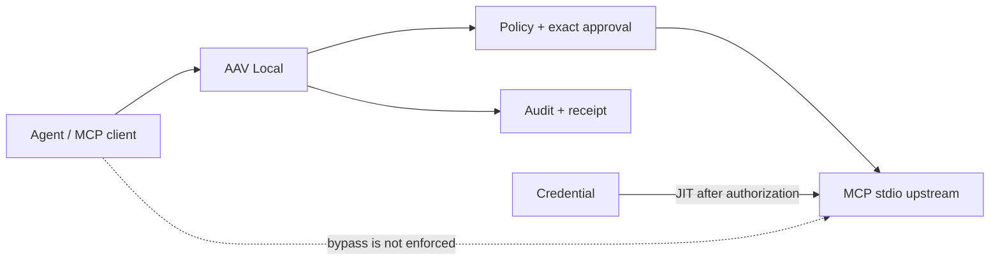

# AAV — Open-source runtime security for AI agent actions

Enforce locally. Approve consequential actions. Isolate credentials. Prove what happened. Cloud optional.

AAV sits between an AI agent's MCP client and tool servers. Discovery never grants execution: every action is checked against default-DENY policy, context-bound approvals, and credential isolation. An audit hash chain and receipts let you verify what happened offline.

## Try it in five minutes

Requires Node.js 24+ and pnpm 10.29.3. Packages are not yet published.

```sh
corepack enable
pnpm install --frozen-lockfile
pnpm build
node packages/cli/dist/bin.js init --name demo
# Set AAV_AUTH_TOKEN to the one-time token printed by init. Do not commit it.
node packages/cli/dist/bin.js mcp add demo --command node --arg packages/cli/dist/bin.js --arg demo-server
node packages/cli/dist/bin.js policy add --tool demo:echo --decision ALLOW
node packages/cli/dist/bin.js policy add --tool demo:dangerous_action --decision REQUIRE_APPROVAL
node examples/mcp-stdio/demo-client.mjs
```

The client launches `aav start`, lists tools, executes an allowed echo, and requests approval for a consequential action. See [quickstart](docs/open-source/quickstart.md) for authentication setup, approval continuation and offline receipt verification. [Docker](docs/docker.md) is an alternative.



## Security boundary and limits

**AAV enforcement only covers actions routed through AAV.** If an agent directly reaches an upstream MCP server, tool endpoint, credential, or a network path bypassing AAV, AAV cannot enforce that bypassed action. It does not prevent prompt injection; it limits action-level consequences. It does not universally guarantee exactly-once external effects after a crash, and does not automatically retry unknown outcomes.

Certified alpha surface: Linux x64, Node.js >=24 (tested versions are recorded in certification evidence), MCP stdio, `tools/list`, `tools/call`, ALLOW, DENY, REQUIRE_APPROVAL, JIT credential isolation, audit-chain v1, receipts, and offline verification. macOS, Windows, Streamable HTTP, resources and prompts are **not yet certified**. This does not mean those systems are broken; do not assume untested compatibility. Node below 24 is outside this alpha's support policy.

See the complete [MCP security model](docs/local/mcp-security-model.md), [proxy API guide](docs/local/mcp-proxy.md), and [package graph/API review](docs/PACKAGE-GRAPH.md).

The separate AAV Cloud service is optional, is not included, and is not required. The SDK remains Cloud-oriented and outside this coordinated OSS release. Official repository: [agentactionverifier/aav](https://github.com/agentactionverifier/aav). All seven OSS packages target `0.1.0-alpha.0` with npm dist-tag `alpha`, never `latest`. The owner authorized repository publication under Apache-2.0 with MCP Option A; external legal counsel review is not represented. npm/image publication remains disabled pending separate authorization. See [release plan](docs/RELEASE-PLAN.md) and [legal review](LEGAL-RELEASE-REVIEW.md).

Report vulnerabilities privately to security@agentactionverifier.com; see [SECURITY.md](SECURITY.md).
